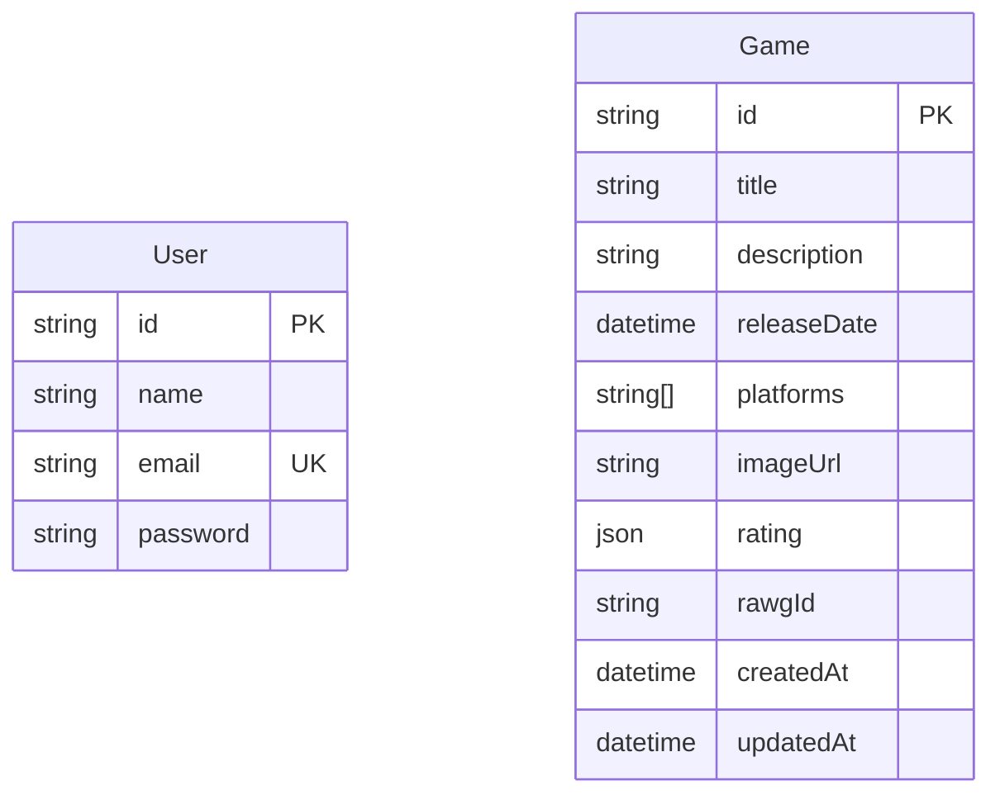

# My Game Vault


## Table of Contents

1. [Getting Started](#getting-started)
1. [ERD](#erd)

## Getting Started

### Prerequisites

- Node.js (v22 or higher)
- Docker and Docker Compose
- pnpm

### Installation

1. **Clone the repository**:
   ```bash
   git clone http
   cd my-game-vault
   ```

2. **Install dependencies**:
   ```bash
   pnpm i
   ```

3. **Set up environment variables**:
   ```bash
   cp .env.example .env
   ```
   Edit the `.env` file to set secure values for secrets.

### Running the Application

1. **Start the services**:
   ```bash
   docker compose up -d
   ```

2. **Run database migrations**:
   ```bash
   pnpm run db:migrate
   ```

3. **Run database seed**:
   ```bash
   pnpm run db:seed
   ```

4. **Start the application**:
   ```bash
   pnpm run start:dev
   ```

The application will now be running at http://localhost:3000

To see docs its running at http://localhost:3000/api

## ERD

The following is the Entity-Relationship Diagram (ERD) for the application:

